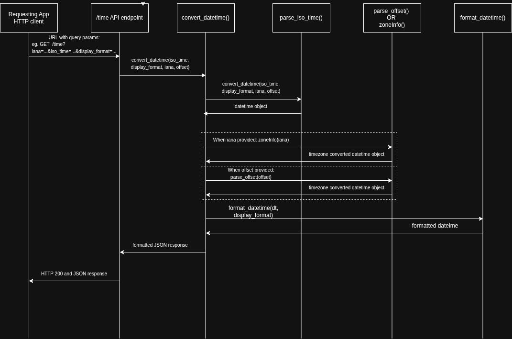

# Oregon State CS361 Microservice 3: Datetime Formatter

## Communication Contract
This microservice will reformat a datetime value based on the end user's specific requests. 
1. Given an ISO datetime value, the datetime value will be formatted as a string for display in either short form (Feb 15, 2026 8:00 AM) or long form (Sunday, Feburary 15, 2026 8:00 AM).
2. Given an ISO timestamp and provided IANA name (eg. America/Los_Angeles), the time will be returned in the desired time zone. 
3. Given the ISO timestamp and timezone offset (eg. -08:00), the time will be returned in the desired offset. 

## API Specification
### Convert DateTime given a provided IANA name
#### Request Example
```
http GET http/time?iso_time=2026-02-11T16:00:00Z&iana=America/Los_Angeles&display_format=short
```

#### Response Example in JSON
```JSON
{
    "formatted":"Feb 11, 2026, 08:00 AM",
    "iso_time":"2026-02-11T16:00:00Z",
    "tz":"America/Los_Angeles"}
```

### Response Format

## API Specification


## UML Sequence Diagram

